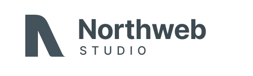

# Northweb Studio — Design System

Version: 1.0
Status: Initial brand system
Brand: Northweb Studio
Primary domain: northweb.studio

---

## 1. Brand Overview

Northweb Studio is a digital studio focused on designing and developing digital solutions for businesses.

Primary services:
- Websites
- E-commerce
- CRM & business systems
- Web applications
- Integrations & automation
- Accessibility and UX
- Social media as a secondary/supporting service

### Brand positioning

Northweb should feel like a modern, capable digital studio rather than a traditional digital marketing agency.

Core idea:

> We design and build digital solutions that help businesses grow.

Primary descriptor:

> Diseño y desarrollo digital

Recommended service descriptor:

> Web · E-commerce · CRM

### Brand personality

Northweb should communicate:

- Modern
- Professional
- Intelligent
- Approachable
- Precise
- Creative
- Technically capable
- Business-oriented
- Clean
- Confident, but not corporate

Avoid:
- Generic "digital agency" aesthetics
- Excessive gradients
- Overly futuristic UI
- Neon colors
- Excessive glassmorphism
- Stock-photo-heavy layouts
- Marketing clichés
- Overly playful startup aesthetics

---

# 2. Logo System

## Primary logo



Use the existing Northweb "N" symbol with the orange accent and the Northweb wordmark.

Preferred lockup:

NORTHWEB
STUDIO

Supporting descriptor may appear separately:

Web · E-commerce · CRM

## Logo variants

1. Primary: dark charcoal N + orange accent + dark wordmark
2. Secondary: dark charcoal N + green accent
3. Dark background: white N + orange accent + white wordmark
4. Dark background: white N + green accent + white wordmark
5. Symbol only: N mark
6. Monochrome: one-color version when required

## Logo rules

- Keep generous clear space around the logo.
- Do not stretch or distort the logo.
- Do not rotate the logo.
- Do not add shadows or effects.
- Do not place the full-color logo on visually busy backgrounds.
- Prefer the orange version as the primary brand expression.
- Use the green version as a secondary accent, not as the dominant identity.

---

# 3. Color System

## Brand colors

### Orange — Primary

HEX: #F26522
RGB: 242, 101, 34
Role:
- Primary CTA
- Links
- Interactive states
- Highlights
- Important brand accents

CSS:
--color-orange-500: #F26522;

### Green — Secondary

HEX: #4CAF50
RGB: 76, 175, 80
Role:
- Secondary accent
- Growth/positive states
- Supporting visual elements
- Selected secondary brand moments

CSS:
--color-green-500: #4CAF50;

### Charcoal — Primary dark

HEX: #2F3E46
RGB: 47, 62, 70
Role:
- Main text
- Dark sections
- Navigation
- Footer
- Headings
- Primary dark UI

CSS:
--color-charcoal-900: #2F3E46;

### Slate

HEX: #6B7884
RGB: 107, 120, 132
Role:
- Secondary text
- Metadata
- Supporting UI

CSS:
--color-slate-500: #6B7884;

### Light gray

HEX: #E9EEF2
RGB: 233, 238, 242
Role:
- Borders
- Section backgrounds
- Cards
- Dividers

CSS:
--color-gray-100: #E9EEF2;

### White

HEX: #FFFFFF
Role:
- Main background
- Text on dark backgrounds
- Cards

CSS:
--color-white: #FFFFFF;

## Recommended semantic tokens

--color-background: #FFFFFF;
--color-background-subtle: #F7F9FA;
--color-background-dark: #2F3E46;
--color-text-primary: #2F3E46;
--color-text-secondary: #6B7884;
--color-text-inverse: #FFFFFF;
--color-border: #E9EEF2;
--color-primary: #F26522;
--color-primary-hover: #D95416;
--color-secondary: #4CAF50;
--color-secondary-hover: #3E9142;

## Color usage ratio

Recommended approximate visual balance:

- 60% white / neutral backgrounds
- 25% charcoal / dark content
- 10% orange
- 5% green

Orange should feel intentional and valuable. Do not use it everywhere.

Green should remain secondary.

---

# 4. Typography

## Primary typeface

Inter

Use Inter for:
- Navigation
- Body copy
- Buttons
- Forms
- Labels
- Cards
- UI
- Technical information

Recommended weights:
- 400 Regular
- 500 Medium
- 600 SemiBold
- 700 Bold

Google Fonts:
https://fonts.google.com/specimen/Inter

## Display typeface

Merriweather

Use sparingly for:
- Hero headlines
- Large editorial statements
- Major section headlines
- Brand storytelling

Recommended weights:
- 400 Regular
- 700 Bold

Google Fonts:
https://fonts.google.com/specimen/Merriweather

## Typography principle

Use Inter for clarity and technology.

Use Merriweather for personality and contrast.

Do not use Merriweather for long paragraphs or dense UI.

---

# 5. Typography Scale

Desktop:

Display:
- 72px / 1.05
- weight 700

H1:
- 56px / 1.08
- weight 700

H2:
- 44px / 1.12
- weight 700

H3:
- 32px / 1.2
- weight 600

H4:
- 24px / 1.3
- weight 600

Body Large:
- 20px / 1.6
- weight 400

Body:
- 16px / 1.6
- weight 400

Body Small:
- 14px / 1.5

Label:
- 12px / 1.4
- weight 600
- letter-spacing: 0.08em
- uppercase when appropriate

Mobile:

Display:
- 44px / 1.08

H1:
- 40px / 1.1

H2:
- 32px / 1.15

H3:
- 26px / 1.2

Body Large:
- 18px / 1.55

Body:
- 16px / 1.55

---

# 6. Layout

## Container

Maximum width:
- 1200px

Recommended:
- width: min(1200px, calc(100% - 48px))

Desktop horizontal padding:
- 24px

Mobile horizontal padding:
- 20px

## Grid

Desktop:
- 12-column grid
- 24px gutters

Tablet:
- 8-column grid

Mobile:
- 4-column grid
- 16px gutters

## Spacing scale

Use a 4px base unit:

4
8
12
16
20
24
32
40
48
64
80
96
120
160

Prefer consistent spacing rather than arbitrary values.

---

# 7. Border Radius

Northweb should feel refined rather than overly rounded.

Small:
- 6px

Medium:
- 10px

Large:
- 16px

Cards:
- 16px

Buttons:
- 8px

Avoid pill-shaped UI except for tags, filters, or small status elements.

---

# 8. Shadows

Use shadows sparingly.

Small:
0 2px 8px rgba(47, 62, 70, 0.06)

Medium:
0 8px 24px rgba(47, 62, 70, 0.10)

Large:
0 20px 50px rgba(47, 62, 70, 0.12)

Prefer borders and contrast over heavy shadows.

---

# 9. Buttons

## Primary button

Background:
#F26522

Text:
#FFFFFF

Border radius:
8px

Height:
48px

Horizontal padding:
20px

Font:
Inter 600 / 15px

Hover:
#D95416

Example:

[ Hablemos de tu proyecto → ]

## Secondary button

Background:
transparent

Text:
#2F3E46

Border:
1px solid #CBD5DA

Hover:
background #F7F9FA

## Text button

No background.

Orange text.

Use arrow icon:

Ver proyectos →

---

# 10. Cards

Cards should be clean and spacious.

Default:
- Background: #FFFFFF
- Border: 1px solid #E9EEF2
- Radius: 16px
- Padding: 28px
- Minimal shadow or no shadow

Hover:
- Slight elevation
- Border becomes slightly darker
- Optional 2px upward translation
- Transition: 180–220ms ease

Avoid excessive card decoration.

---

# 11. Iconography

Use simple outline icons.

Preferred style:
- 1.5px to 2px stroke
- Rounded joins
- Minimal detail
- Consistent visual weight

Suggested icon categories:

Website
E-commerce
CRM
Applications
Integrations
Analytics
Accessibility
Automation
SEO
Performance
Security

Lucide Icons is a good default icon library.

Do not mix multiple icon styles.

---

# 12. Imagery

Photography should feel:
- Premium
- Real
- Modern
- Business-oriented
- Human
- Technology-focused

Prefer:
- Workspaces
- Devices
- Real products
- Business environments
- Close-up details
- Architectural compositions
- Product UI

Avoid:
- Generic handshake photos
- Obvious corporate stock photography
- People pointing at charts
- Excessively staged office scenes

Use photography with generous negative space when possible.

---

# 13. UI Style

Northweb interfaces should combine:

- Editorial typography
- Strong whitespace
- High contrast
- Subtle borders
- Restrained rounded corners
- Orange interaction accents
- Charcoal sections
- Large typography
- Clear hierarchy

Visual reference:

Premium digital studio + modern SaaS + editorial design.

Do not make the site look like a generic SaaS dashboard.

---

# 14. Motion

Motion should be subtle and purposeful.

Recommended:
- 180–300ms transitions
- ease-out
- subtle hover elevation
- fade/slide on scroll
- restrained image reveals

Avoid:
- excessive parallax
- constant floating animations
- bouncing elements
- distracting cursor effects
- animation that interferes with accessibility

Respect:

prefers-reduced-motion: reduce

---

# 15. Accessibility

Accessibility is a core Northweb value and should influence both the brand and the product.

Requirements:
- WCAG 2.2 AA target
- Keyboard accessible navigation
- Visible focus indicators
- Semantic HTML
- Proper heading hierarchy
- Accessible form labels
- Sufficient color contrast
- No information conveyed by color alone
- Reduced-motion support
- Touch targets at least 44x44px
- Alt text for meaningful images
- Decorative images marked appropriately

Focus indicator:

outline: 3px solid #F26522;
outline-offset: 3px;

Do not remove browser focus styles without replacing them with a stronger accessible alternative.

---

# 16. Navigation

Desktop navigation:

Logo | Services | Projects | About | Insights | Contact

Primary CTA:

Hablemos → 

Keep navigation simple.

Mobile:
- Logo
- Menu button
- Full-screen or slide-down navigation

---

# 17. Homepage Structure

Recommended homepage:

1. Header
2. Hero
3. Services
4. Selected projects
5. Why Northweb
6. Process
7. Technology / capabilities
8. Accessibility / quality statement
9. CTA
10. Footer

## Hero direction

Eyebrow:
DISEÑO Y DESARROLLO DIGITAL

Headline:

Soluciones digitales
para hacer crecer
tu negocio.

Use Merriweather selectively for emphasis.

Highlight one phrase with Northweb orange.

Supporting copy:

Diseñamos y desarrollamos sitios web, e-commerce y sistemas digitales a la medida que ayudan a las empresas a trabajar mejor y crecer.

Primary CTA:
Hablemos de tu proyecto →

Secondary:
Ver proyectos →

---

# 18. Services Messaging

## Websites

Diseñamos y desarrollamos sitios web rápidos, accesibles y pensados para convertir visitantes en clientes.

## E-commerce

Creamos experiencias de compra simples, rápidas y conectadas con las herramientas que tu negocio necesita.

## CRM & Systems

Construimos sistemas para organizar clientes, ventas y procesos internos.

## Web Applications

Desarrollamos herramientas digitales personalizadas para necesidades específicas de cada negocio.

---

# 19. Brand Voice

Northweb should sound:

Clear.
Confident.
Knowledgeable.
Human.
Direct.

Prefer:
"Construimos"
"Diseñamos"
"Desarrollamos"
"Conectamos"
"Automatizamos"
"Mejoramos"

Avoid:
"Revolucionamos"
"Disruptivo"
"Soluciones 360°"
"Sinergias"
"Transformación digital de alto impacto"
"Somos líderes"
"Los mejores"

The brand should demonstrate expertise rather than claim superiority.

---

# 20. Recommended Homepage Copy Direction

Hero:

DISEÑO Y DESARROLLO DIGITAL

# Soluciones digitales para hacer crecer tu negocio.

Diseñamos y desarrollamos sitios web, e-commerce y sistemas digitales que ayudan a las empresas a trabajar mejor y crecer.

CTA:
Hablemos de tu proyecto →

Secondary:
Ver proyectos →

Services heading:

# Más que un sitio web.

Desde una landing page hasta un sistema completo para administrar tu negocio.

Service labels:

WEB
E-COMMERCE
CRM
APPS

---

# 21. Tailwind / CSS Tokens

Use these tokens as the base for implementation:

```css
:root {
  --color-primary: #F26522;
  --color-primary-hover: #D95416;

  --color-secondary: #4CAF50;
  --color-secondary-hover: #3E9142;

  --color-charcoal-900: #2F3E46;
  --color-slate-500: #6B7884;

  --color-gray-100: #E9EEF2;
  --color-gray-50: #F7F9FA;

  --color-white: #FFFFFF;

  --font-sans: "Inter", sans-serif;
  --font-display: "Merriweather", serif;

  --radius-sm: 6px;
  --radius-md: 10px;
  --radius-lg: 16px;

  --shadow-sm: 0 2px 8px rgba(47, 62, 70, 0.06);
  --shadow-md: 0 8px 24px rgba(47, 62, 70, 0.10);
  --shadow-lg: 0 20px 50px rgba(47, 62, 70, 0.12);

  --container-max: 1200px;
}
```

---

# 22. AI Design Instructions

When generating Northweb designs, follow these rules:

1. Use the Northweb color system exactly.
2. Orange is the primary accent.
3. Green is secondary and should be used sparingly.
4. Use charcoal for dark sections and primary text.
5. Use Inter for UI/body and Merriweather for selected display headlines.
6. Prioritize whitespace and hierarchy.
7. Keep the visual language premium and modern.
8. Avoid generic digital-agency templates.
9. Avoid excessive gradients and glassmorphism.
10. Avoid excessive rounded UI.
11. Use real, purposeful imagery.
12. Prioritize accessibility and WCAG 2.2 AA.
13. Design mobile-first and responsive.
14. Use semantic HTML.
15. Maintain strong keyboard focus states.
16. Keep animations subtle and respect reduced-motion preferences.
17. The website should feel like a small, expert digital studio rather than a large corporate agency.
18. The primary business message is digital design + development, not social media marketing.
19. Social media is secondary to websites, e-commerce, CRM and applications.
20. The overall aesthetic should feel sophisticated, technical, editorial and approachable.

---

# 23. Suggested Technology Stack

Preferred implementation:

- Astro or SvelteKit
- Tailwind CSS
- TypeScript
- Semantic HTML
- Lucide Icons
- Google Fonts: Inter + Merriweather

Recommended priorities:

Performance
Accessibility
SEO
Responsive design
Clean semantic markup
Maintainable components

Target:
- Lighthouse Performance: 90+
- Lighthouse Accessibility: 95+
- Lighthouse SEO: 95+

---

# 24. Design System Summary

Northweb Studio:

BRAND:
Northweb Studio

POSITIONING:
Diseño y desarrollo digital

SERVICES:
Web · E-commerce · CRM · Applications

PRIMARY:
#F26522

SECONDARY:
#4CAF50

DARK:
#2F3E46

BODY:
Inter

DISPLAY:
Merriweather

STYLE:
Modern · Editorial · Technical · Premium · Approachable

CORE PRINCIPLE:

> Design beautifully. Build properly. Make it useful.
